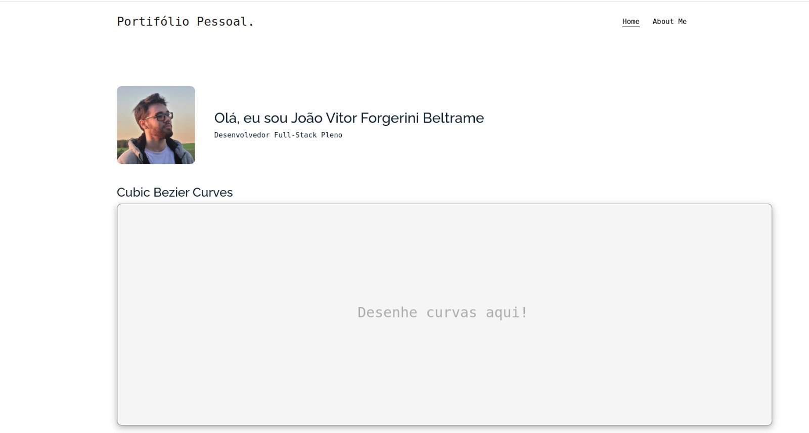

# Portifólio de João Vítor

.

Acesso: https://elc1090.github.io/project1-Gilsonlgd/

#### Desenvolvedor(a)
Gilson Garcia da Silva Júnior

#### Cliente
João Vitor Forgerini Beltrame

#### Tecnologias
- HTML
- CSS
- JavaScript
- Bootstrap

#### Ambiente de desenvolvimento
- VS Code
- Google Chrome

#### Créditos
- 
- 
- 

#### Bastidores

O cliente já possuía uma página que usava como portfólio, onde apresentava seu trabalho desenvolvido para a disciplina de Computação Gráfica em Canvas 2D. Ele expressou a necessidade de melhorar a apresentação da página, para que além de demonstrar seu trabalho, ela pudesse conter detalhes sobre suas qualidades e experiências profissionais.

Com isso em mente, iniciamos a busca por um template que possibilitasse esse trabalho e, após a escolha, começamos a fase de desenvolvimento.

O primeiro desafio foi integrar o trabalho que ele já havia feito com o que buscávamos. Depois de estudar o código e fazer algumas personalizações em CSS, conseguimos integrar o trabalho em canvas ao template.

O segundo desafio foi estruturar a página de forma a incorporar o trabalho com informações sobre o cliente, de modo que o conteúdo se complementasse e a leitura fosse fluida. Depois de desenvolver alguns layouts, encontramos a melhor versão.

O portfólio é dividido em duas páginas: a principal, que mostra os trabalhos, e a secundária, que contém informações pessoais sobre João. O trabalho foi desenvolvido buscando minimalismo, fluidez e responsividade, embora a parte de responsividade ainda precise de algumas melhorias.

---
Projeto entregue para a disciplina de [Desenvolvimento de Software para a Web](http://github.com/andreainfufsm/elc1090-2023a) em 2023a